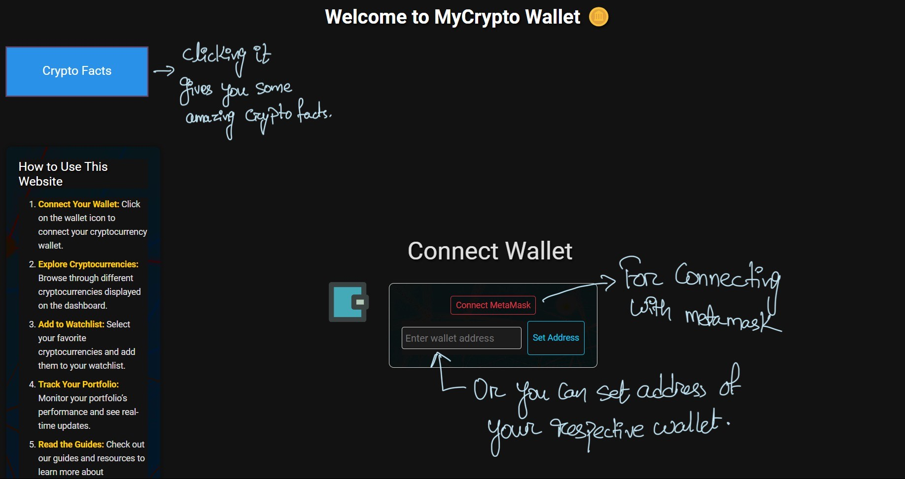
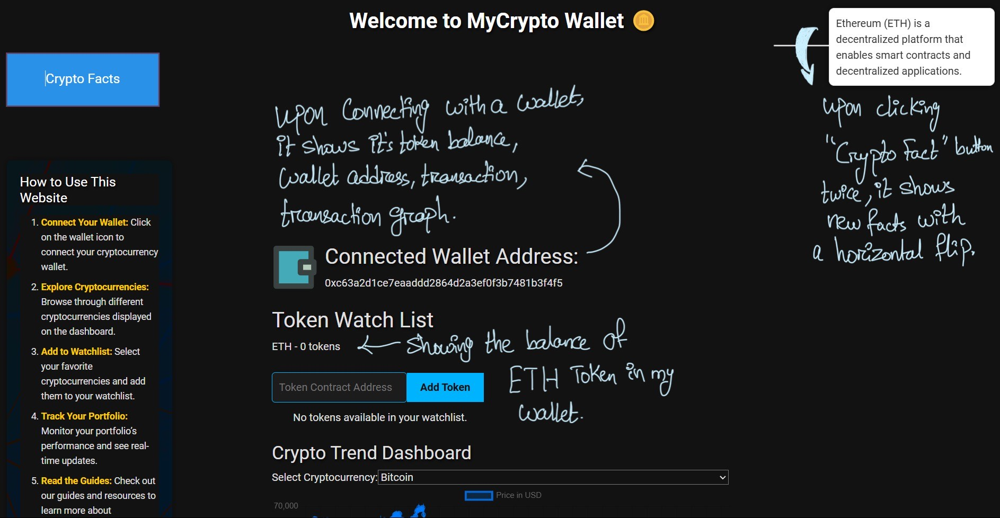
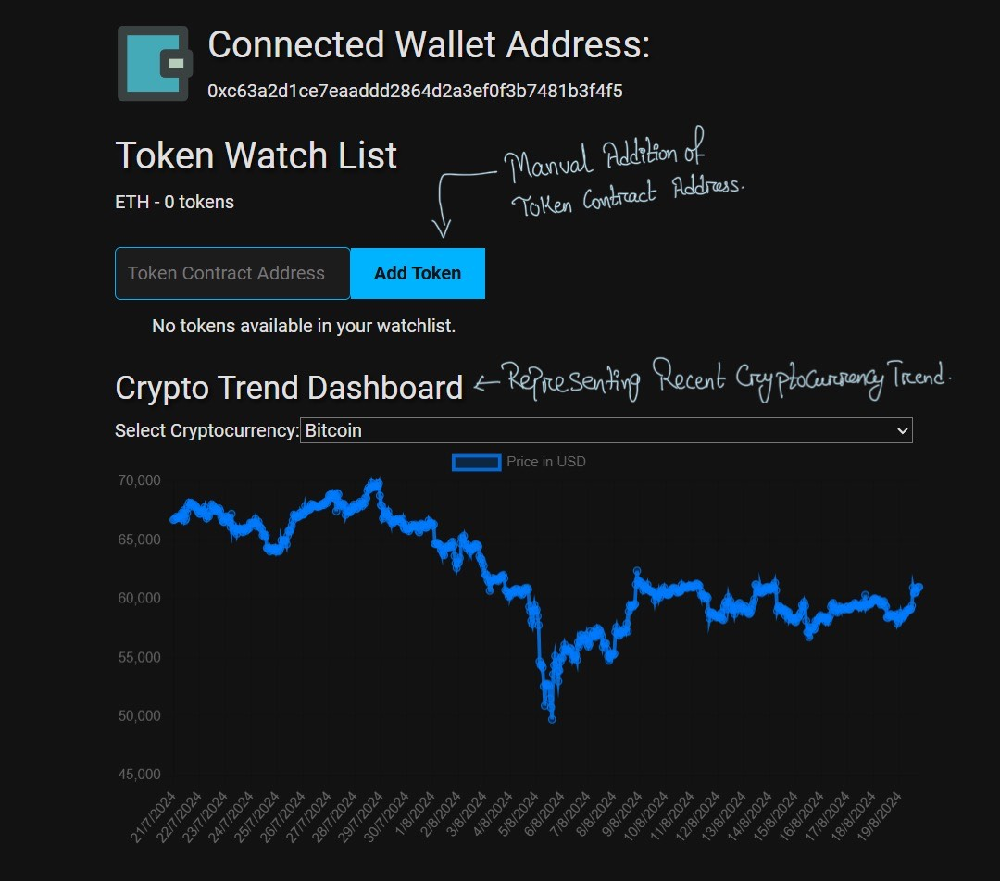
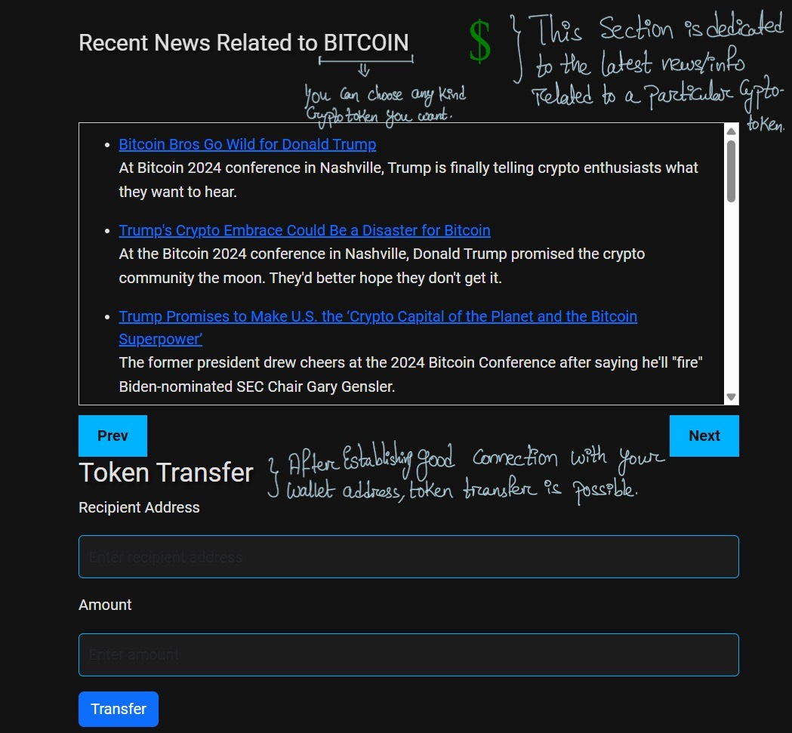

```markdown
# Crypto Portfolio App

This project is a Crypto Portfolio App built with React. It enables users to connect their crypto wallet, view their crypto assets, track a watch list of tokens, and perform token transfers. The app also includes features like historical data visualization, a crypto dashboard, and an interactive SVG animation.

## Table of Contents

- [Features](#features)
- [Project Structure](#project-structure)
- [Getting Started](#getting-started)
  - [Installation](#installation)
  - [Available Scripts](#available-scripts)
- [Token Transfer Functionality](#token-transfer-functionality)
- [Screenshots](#screenshots)
- [Learn More](#learn-more)

## Features

- **Wallet Connection**: Connect your crypto wallet using MetaMask.
- **Watch List**: Keep track of your favorite cryptocurrencies.
- **Crypto Dashboard**: View detailed information about selected tokens along with the interactive graph.
- **Token Transfer**: Transfer tokens to other wallets directly from the app.
- **Interactive SVG Animation**: Engaging visual elements to enhance user experience.
- **Historical Data Visualization**: View the historical performance of cryptocurrencies.

## Project Structure

```
crypto-portfolio-app/
│
├── public/
├── src/
│   ├── assets/
│   │   ├── images
│   ├── components/
│   │   ├── WatchList.js
│   │   ├── CryptoDashboard.js
│   │   ├── CryptoGuide.js
│   │   ├── CryptoGuide.css
│   │   ├── HistoricalData.js
│   │   ├── InteractiveSVG.js
│   │   ├── InteractiveSVG.css
│   │   ├── TokenTransfer.js
│   │   └── TokenAllowance.js
│   ├── services/
│   │   ├── api.js
│   ├── WalletConnection.js
│   ├── WalletConnection.css
│   ├── WalletContext.js
│   ├── App.js
│   ├── App.css
│   └── index.js
│   └── index.css
│   └── firebaseConfig.js
│
└── README.md
```

## Getting Started

### Installation

1. Clone the repository:
   ```bash
   git clone https://github.com/your-username/Crypto-portfolio.git
   cd Crypto-portfolio
   ```

2. Install dependencies:
   ```bash
   npm install
   ```

### Available Scripts

In the project directory, you can run:

#### `npm start`

Runs the app in development mode.\
Open [http://localhost:3000](http://localhost:3000) to view it in your browser.

The page will reload when you make changes.\
You may also see any lint errors in the console.

#### `npm run build`

Builds the app for production to the `build` folder.\
It correctly bundles React in production mode and optimizes the build for the best performance.

#### `npm run eject`

**Note: this is a one-way operation. Once you `eject`, you can't go back!**

## Token Transfer Functionality

The app includes a token transfer feature that allows users to send tokens to a recipient's address.

### TokenTransfer.js

This component includes:

- A form for the recipient's address and the amount.
- Validation to ensure the recipient address and transfer amount are correct.
- Logic using `ethers.js` to handle the transaction.

### Example Code:

```javascript
import React, { useState, useContext } from 'react';
import { WalletContext } from './WalletContext';
import { ethers } from 'ethers';

const TokenTransfer = () => {
  const { contract } = useContext(WalletContext);
  const [recipient, setRecipient] = useState('');
  const [amount, setAmount] = useState('');
  const [status, setStatus] = useState('');

  const handleTransfer = async () => {
    try {
      if (!ethers.utils.isAddress(recipient)) {
        setStatus('Invalid recipient address');
        return;
      }
      const tx = await contract.transfer(recipient, ethers.utils.parseUnits(amount, 18));
      setStatus('Transaction sent: ' + tx.hash);
      await tx.wait();
      setStatus('Transaction successful');
    } catch (error) {
      setStatus('Transaction failed: ' + error.message);
    }
  };

  return (
    <div>
      <h2>Transfer Tokens</h2>
      <input
        type="text"
        placeholder="Recipient Address"
        value={recipient}
        onChange={(e) => setRecipient(e.target.value)}
      />
      <input
        type="number"
        placeholder="Amount"
        value={amount}
        onChange={(e) => setAmount(e.target.value)}
      />
      <button onClick={handleTransfer}>Transfer</button>
      <p>{status}</p>
    </div>
  );
};

export default TokenTransfer;
```

## Screenshots

### Home Page


### Wallet Connection


### Dashboard


### Token Transfer


### Live Link
[View the live application here](https://magnificent-tapioca-bbe60e.netlify.app/)

## Learn More

To learn more about the tools and technologies used in this project:

- [Create React App documentation](https://facebook.github.io/create-react-app/docs/getting-started)
- [React documentation](https://reactjs.org/)
- [Ethers.js documentation](https://docs.ethers.io/v5/)
- [Bootstrap documentation](https://getbootstrap.com/)
- [Tailwind CSS documentation](https://tailwindcss.com/docs)

```
